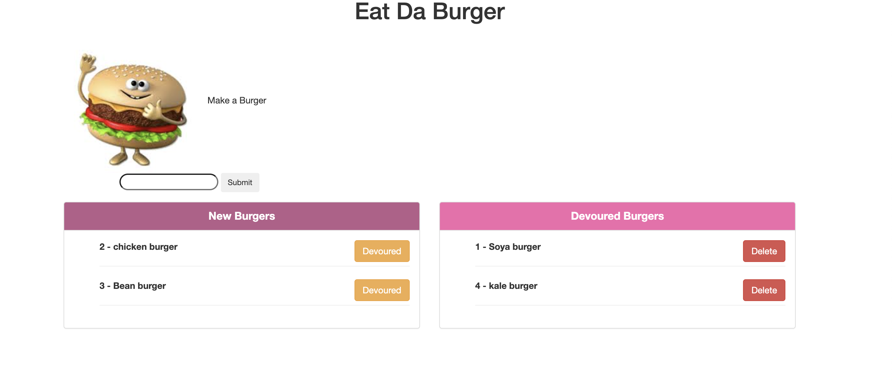

# gwuHomework13
## Eat-Da-Burger App

Eat-Da-Burger! is a app that lets users input the names of burgers they'd like to eat. Whenever a user submits a burger's name, the app will display the burger on the left side of the page -- waiting to be devoured. Each burger in the waiting area also has a Devour! button. When the user clicks it, the burger will move to the right side of the page. This App also allows you to delete devoured burgers.  

## Heroku link
https://mighty-beach-48512.herokuapp.com/

## Portfolio link
https://menuka786.github.io/Homeworktwo/

## Screen Shot

## Technologies Used

#### MySQL

#### Node.JS

#### Express.JS

#### Handlebars
